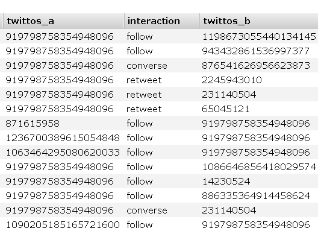

# TrollHunter

TrollHunter is a Twitter Crawler & News Website Indexer.
It aims at finding Troll Farmers & Fake News on Twitter.

It composed of three parts:

- Twint API to extract information about a tweet or a user
- News Indexer which indexes all the articles of a website and extract its keywords
- Analysis of the tweets and news

## Installation

### Docker

TrollHunter requires many services to run

- ELK ( Elastic Search, Logstash, Kibana)
- InfluxDb & Grafana
- RabbitMQ

You can either launch them individually if you already have them setup or use our `docker-compose.yml`

- Install Docker
- Run `docker-compose up -d`

Change the `.env` with the required values
Export the `.env` variables

```Bash
export $(cat .env | sed 's/#.*//g' | xargs)
```

You can either run

```Bash
pip3 install TrollHunter
```

or clone the project and run

```Bash
pip3 install -r requirements.txt
```

## Twitter crawler

### Twint

For crawl tweets and extract user's information we use Twint wich allow us to get many information without
using Twitter api.

Some of the benefits of using Twint vs Twitter API:

- Can fetch almost all Tweets (Twitter API limits to last 3200 Tweets only);
- Fast initial setup;
- Can be used anonymously and without Twitter sign up;
- No rate limitations.

When we used twint, we encountered some problems:

- Bad compatibility with windows and datetime
- We can't set a limit on the recovery of tweets
- Bug with some user-agent

So we decided to [fork](https://github.com/quentin-derosin/twint) the project.

With allow us to:

- get tweets
- get user information
- get follow and follower
- search tweet from hashtag or word

### API

For this we use the open-source framework flask.

Four endpoints are defined and their

- ```/tweets/<string:user>```
  - get all informations of a user (tweets, follow, interaction)

- ```/search```
  - crawl every 2 hours tweets corresponding to research
  
- ```/stop```
  - stop the search

- ```/tweet/origin```
  - retrieve the origin of a tweets

Some query parameters are available:

- ```tweet```:          set to 0 to avoid tweet (default: 1)
- ```follow```:         set to 0 to avoid follow (default: 1)
- ```limit```:          set the number of tweet to retrieve (Increments of 20, default: 100)
- ```follow_limit```:   set the number of following and followers to  retrieve (default: 100)
- ```since```:          date selector for tweets (Example: 2017-12-27)
- ```until```:          date selector for tweets (Example: 2017-12-27)
- ```retweet```:        set to 1 to retrieve retweet (default: 0)
- ```search```:
  - search terms format "i search"
  - for hashtag : (#Hashtag)
  - for multiple : (#Hashtag1 AND|OR #Hashtag2)
- ```tweet_interact```: set to 1 to parse tweet interaction between users (default: 0)
- ```depth```:          search tweet and info from list of follow

### Twitter Storage

Information retrieve with twint is stored in elastic search, we do not use the default twint storage format as we want a stronger relationship parsing.
There is currently three index:

- twitter_user
- twitter_tweet
- twitter_interaction

The first and second index are stored as in twitter. The third is build to store interaction from followers/following, conversation and retweet.



## News Indexer

The second main part of the project is the crawler and indexer of news.

For this, we use the sitemap xml file of news websites to crawl all the articles. In a sitemap file, we extract the tag
*sitemap* and *url*.

The *sitemap* tag is a link to a child sitemap xml file for a specific category of articles in the website.

The *url* tag represents an article/news of the website.  

The root url of a sitemap is stored in a postgres database with a trust level of the website (Oriented, Verified,
Fake News, ...) and headers. The headers are the tag we want to extract from the *url* tag which contains details about
the article (title, keywords, publication date, ...).

The headers are the list of fields use in the index pattern of ElasticSearch.

In crawling sitemaps, we insert the new child sitemap in the database with the last modification date or update it for
the ones already in the database. The last modification date is used to crawl only sitemaps which change since the
last crawling.

The data extracts from the *url* tags are built in a dataframe then sent in ElasticSearch for further utilisation with
the request in Twint API.

In the same time, some sitemaps don't provide the keywords for their articles. Hence, from ElasticSearch we retrieve the
entries without keywords. Then, we download the content of the article and extract the keywords thanks to NLP. Finally,
we update the entries in ElasticSearch.

### Run

For the crawler/indexer:

```python
from TrollHunter.news_crawler import scheduler_news

scheduler_news(time_interval)
```

For updating keywords:

```python
from TrollHunter.news_crawler import scheduler_keywords

scheduler_keywords(time_interval, max_entry)
```

Or see with the [main](https://github.com/StanGirard/TrollHunter/tree/master/docker/news_crawler) use with docker.  

## Grafana

We use grafana for visualizing and monitoring different events with the crawler/indexer as
the insertion of an url in ElasticSearch and the extraction of keywords in an article.


